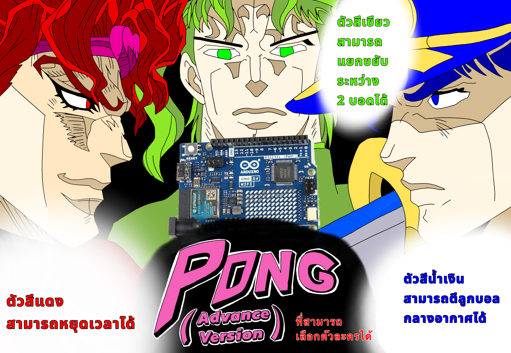

# Physical Computing Project 2024 - IT KMITL 🧑‍💻🧑‍💻🧑‍💻
Project นี้เป็นส่วนหนึ่งของงานในวิชา Physical Computing โดยสามารถเข้าไปดูใน [Website ตรงนี้เลย](https://66070252.github.io/Arduino-Pong-Game/)👈

# คำอธิบายพร้อม 🖥️ Demo
Pong เป็นเกมที่เรารู้จักกันเป็นอย่างดีซึ่งครั้งนี้เราสามารถเล่นได้ผ่าน board Arduino โดย board ที่ใช้เป็นรุ่น Arduino Uno R4 wifi โดย pong ที่เราเล่นสามารถเลือกตัวและใช้ความสามารถเฉพาะแต่ละตัวได้ซึ่งสามารถดูได้โดย [กดตรงนี้](https://youtu.be/22YZ9LpsVXY)👈 (ในตัว code มีการอธิบาย code โดยย่อไว้แล้ว)

# Poster 🎩

# สมาชิก 😃😐😐

| รูป | รหัสนักศึกษา     | ชื่อ                  | ส่วนที่รับผิดชอบ               |
| --- | -------- | --------------------- | ------------------------------ |
|     | 66070038 | ชยพล ชื่นชาวนา (โยจิ)  | Coding               |
|     | 66070040 | ชลณวัตร ศรีวรกุล (ปอร์เช่)| illustrator              |
|     | 66070252 | ชาญชัย ธรรมโชติ  (โอม)  | Web page     |
